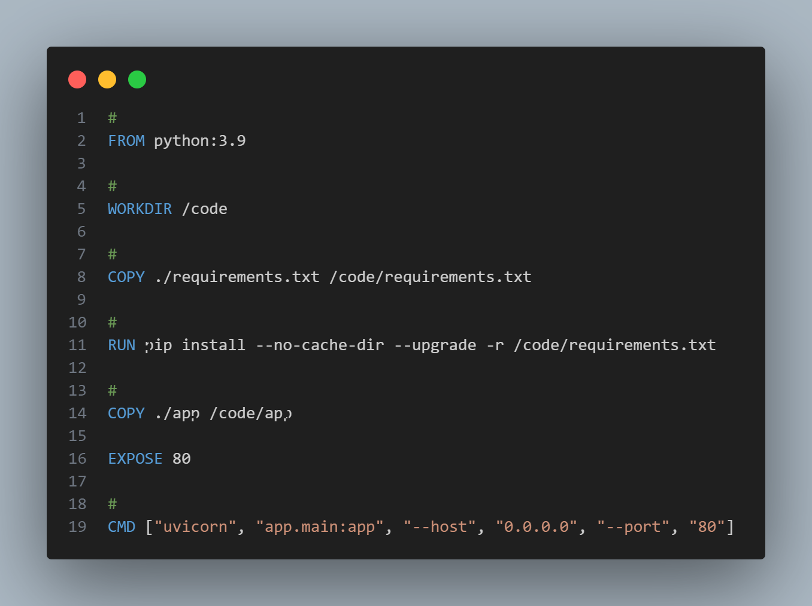

# Execução de uma aplicação containerizada 

Detalhamento do desenvolvimento de uma página de curriculo, sua build para uma imagem docker e sua construção como um container.

## Aplicação

O Frontend da aplicação foi desenvolvido com HTML e CSS e seu Backend foi usado Python com FastApi

## Containerização
Para a containerização foi criado um Dockerfile e nele definimos a versão 3.9 do python como imagem base, copiamos nosso requirements.txt e logo abaixo rodamos ela como pip install. Após isso copiamos todo o resto dos arquivos e expomos a porta 80. Ao fim executamos o comando para iniciar o servidor 



E por fim rodamos o seguinte código
```
docker build -t meu-curriculo .
```

## Como executar a imagem
Link do repositório no Dockerhub: https://hub.docker.com/r/mihaell/ponderadas

No seu terminal e **em sua pasta selecionada**, baixe a imagem do DockerHub através do comando:
```
docker push mihaell/ponderadas:latest
```

Construa seu container:
```
docker build -t meu-curriculo:seu-container .
```

Rode o container criado:
```
docker run -p 80:80 seu-container
```

Acesse o endereço:
```
http://localhost:8080/
```
