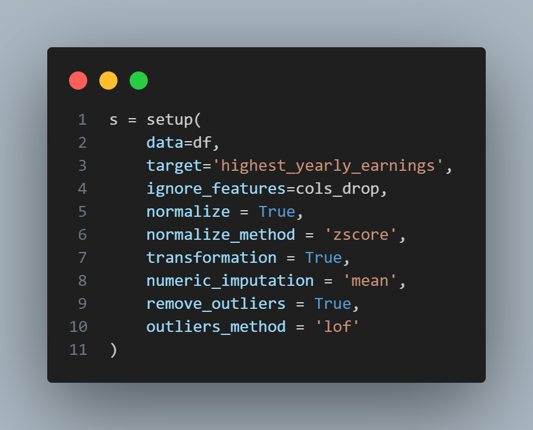

# Deploy de modelo de Machine Learning

## Descrição

Nesta atividade foi criada uma API para um modelo de Machine Learning dockerizada. Foi usado o dataset 
[Youtube statistic](https://www.kaggle.com/datasets/nelgiriyewithana/global-youtube-statistics-2023) para a predição do rendimento anual maximo de uma conta do youtube com base nas visualizações do ultimo 30 dias, minimos e maximos de rendimentos mensais e minimo anual.

### Modelo e Processamento
Para processamento dos dados primeiro foi feita uma seleção de features das 28 da tabela onde foi escolhido apenas 5. **As colunas comentadas não serão ignoradas na etapa de setup pelo pycaret**


Para etapa de **setup** foi escolhida apos diversos testes de resultado as seguintes processamentos dos dados:
- Normalização pelo método de Z Score
- Transformação do target
- inputação numerica das colunas com dados faltando através da media da coluna
- remoção de outlier usando o método do sklearn LocalOutlierFactor



**Output gerado pelo setup**


## Execução

Navegue até a pasta que queira executar a aplicação e clone a imagem do docker hub usando o comando abaixo

```bash
docker pull mihaell/api_model_tag:latest
```

Caso tenha problemas na execução, a imagem pode ser encontrada [aqui](https://hub.docker.com/repository/docker/mihaell/api_model_tag/general)
Além de se encontrar também nesse repositório que pode ser clonado e executado

execute o comando:

```bash
docker run -p 8000:8000 mihaell/api_model_tag:latest
```
Acesse o navegador e abra a aplicação em execução nesse [link](localhost:8000/)

